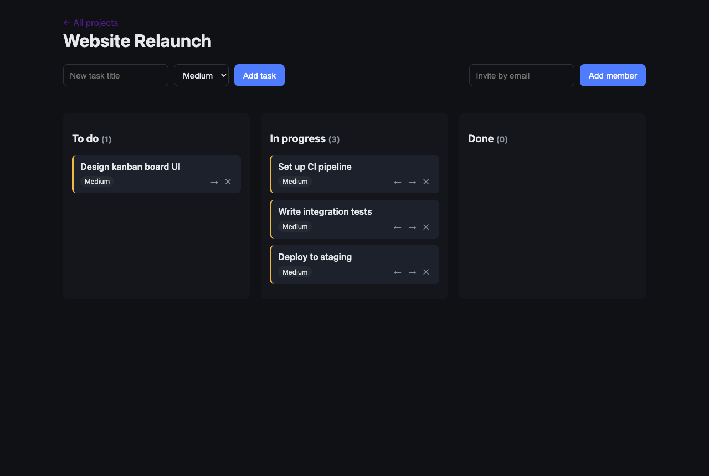
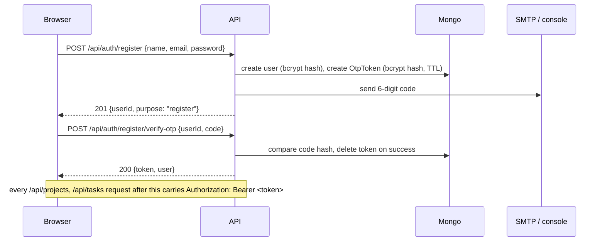
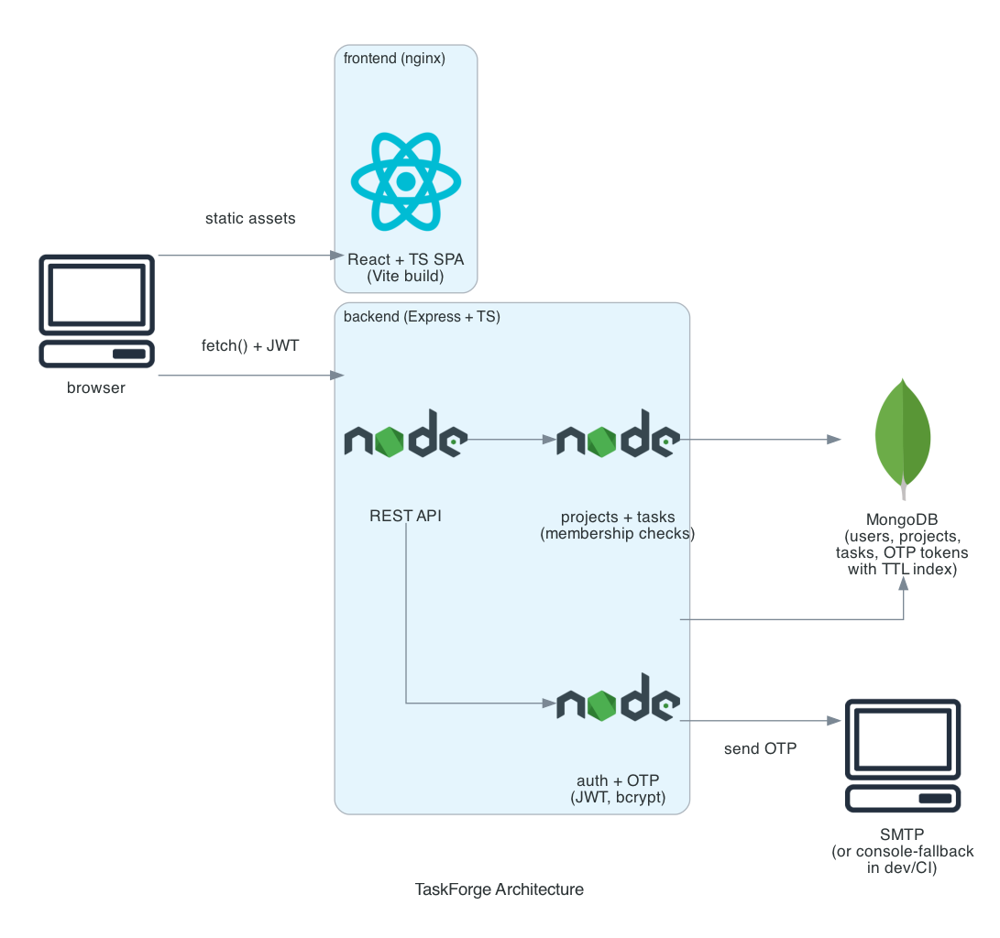
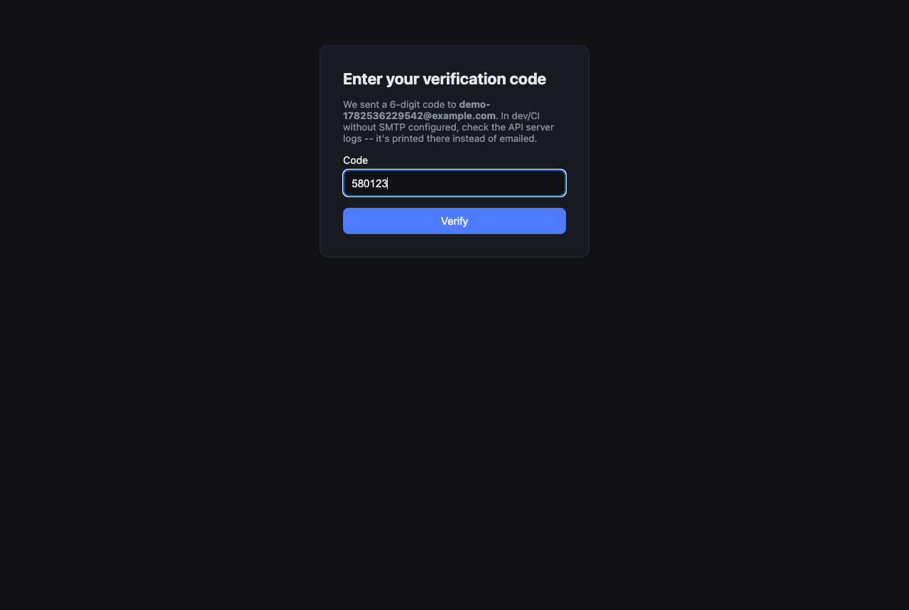

# TaskForge

[](https://github.com/kartik117/taskforge/actions/workflows/ci.yml)

A project & task management API and React board, built around a two-step OTP login: password gets you nowhere on its own, a JWT is only minted after the matching email code is verified.



## Why this stack

| Layer | Choice | Why |
|---|---|---|
| API | Node.js + Express + TypeScript | This project calls for Node/Sequelize/MySQL -- that combination is already the [`webapp`](https://github.com/kartik117/webapp) repo (EduAssign Manager). This one leans into MongoDB/Mongoose instead, for real stack variety across the batch rather than two near-identical Node+SQL repos. |
| Auth | JWT + 2-step OTP | Password login only gets you an OTP; a token is issued from `/verify-otp`, not `/login`. Same flow, parameterized by `purpose`, covers both registration and login. |
| DB | MongoDB + Mongoose | Document model fits projects-with-embedded-member-lists naturally; a Mongo TTL index expires spent OTP tokens without a cron job. |
| Frontend | React + TypeScript + Vite | Small SPA: auth pages, OTP entry, project list, kanban board. No Redux/state library -- the app is small enough that `useState` + one `AuthContext` covers it. |
| Tests | Jest + Supertest + mongodb-memory-server | Tests hit a real in-memory `mongod` and a real running Express app through HTTP, not mocks -- the OTP tests in particular read the actual generated code off a transport-boundary event emitter, never special-cased business logic to make it testable. |

## How auth actually works



A wrong code increments an attempt counter; 5 wrong attempts in a row invalidate the token outright (see Engineering notes -- this exact boundary had an off-by-one bug, found by a test).

## Architecture



`requireAuth` → `validateBody(zodSchema)` → `asyncHandler(controller)` compose at the router level so controllers stay thin: read an already-validated `req.body`, call a service, return. Every project/task read or write funnels through one `getProjectForMember()` check in `projectService.ts`, so the 404-vs-403 distinction (project doesn't exist vs. you're just not on it) can't drift between endpoints.

## Running it

```bash
docker compose up -d --build
# mongo -> backend -> frontend, in that order (backend waits on mongo's healthcheck)

curl http://localhost:4000/health
open http://localhost:3000
```

No SMTP is configured by default -- OTP codes are logged instead of emailed:

```bash
docker compose logs backend | grep console-fallback
# {"level":"info",...,"to":"you@example.com","code":"532897","msg":"[console-fallback] OTP code..."}
```

To send real emails instead, set `SMTP_HOST`/`SMTP_PORT`/`SMTP_USER`/`SMTP_PASS` before bringing the stack up.

**Local development (without Docker):**

```bash
cd backend && npm install && npm run dev   # needs MONGO_URI pointed at a real Mongo
cd frontend && npm install && npm run dev  # served on :3000, talks to :4000
```

**Tests:**

```bash
cd backend && npm test -- --coverage   # 32 tests, real in-memory MongoDB, ~92% statement coverage
cd frontend && npm run build           # type-checks + production build
```

## Verified screenshot: OTP step



This screenshot was captured by an actual headless-Chrome run of the app against the real API -- the code shown was read out of the backend's structured logs by the same script, not hand-typed.

## Project structure

```
taskforge/
├── backend/
│   ├── src/
│   │   ├── config/        # zod-validated env
│   │   ├── models/        # User, Project, Task, OtpToken (Mongoose)
│   │   ├── services/      # authService, otpService, projectService, taskService, mailer
│   │   ├── controllers/   # thin -- validate via middleware, call a service
│   │   ├── middleware/    # requireAuth, validateBody, asyncHandler, errorHandler
│   │   └── routes/
│   └── tests/
│       ├── unit/          # otp, jwt, AppError
│       └── integration/   # auth, projects, tasks, otpService -- real in-memory Mongo
├── frontend/
│   └── src/
│       ├── api/            # fetch client + typed endpoint functions
│       ├── context/        # AuthContext (JWT in localStorage)
│       ├── pages/          # Register, Login, VerifyOtp, Projects, ProjectBoard
│       └── components/     # TaskColumn, TaskCard
├── scripts/architecture_diagram.py
└── docker-compose.yml
```

## Engineering notes

**A real off-by-one in the OTP lockout, caught by a test.** `verifyOtp` checked `attempts >= MAX_ATTEMPTS` *before* incrementing on a wrong guess. That meant the 5th wrong attempt only bumped `attempts` from 4 to 5 -- the cap check on *that* call had already passed, using the old value of 4. The token only actually got deleted on a 6th call, which also returned the wrong error message (`"Incorrect verification code"` instead of the lockout message). A test asserting the token was gone after exactly 5 wrong attempts failed against the real code, not a contrived case. Fixed by incrementing first, then checking the cap against the new value, in [`otpService.ts`](backend/src/services/otpService.ts).

**`dotenv` was a listed dependency that was never actually loaded anywhere** until I tried to run the built server outside of Jest (where env vars are injected directly) and got `Invalid environment configuration` despite a real `.env` file sitting right next to it. `import 'dotenv/config'` in `config/env.ts` fixed it. Tests were never affected since Jest's `setupFiles` sets `process.env` directly before `dotenv` ever runs, and `dotenv` doesn't override existing values -- but it's a good example of a gap unit tests alone don't catch, only actually running the thing does.

**`tsc`'s `rootDir`/`include` mismatch silently nested `dist/src/` instead of `dist/`.** With `rootDir: "."` and both `src` and `tests` in `include`, the compiler mirrored both directories under `dist/`, so `node dist/server.js` 404'd looking for a file that was actually at `dist/src/server.js`. Tests don't go through `tsc`'s project-wide compile at all (`ts-jest` compiles per-file against the same `compilerOptions` regardless of `include`), so this only surfaced when actually starting the server -- another argument for running the real `docker compose up` instead of trusting `tsc --noEmit` alone.

**Mailer testability without mocking.** Rather than mock `sendOtpEmail` in tests, it emits onto a plain `EventEmitter` (`otpEvents`) every time it sends -- real SMTP path or console-fallback alike. Tests subscribe to the same event a real downstream consumer would, and read the OTP that was actually generated by the actual code path, not a stand-in value asserted against itself.

**Known simplifications:** no refresh tokens (JWTs are short-lived and re-auth is just login-again); no project roles beyond owner/member; BM25-style search, comments, and subtasks weren't in scope for this pass.
